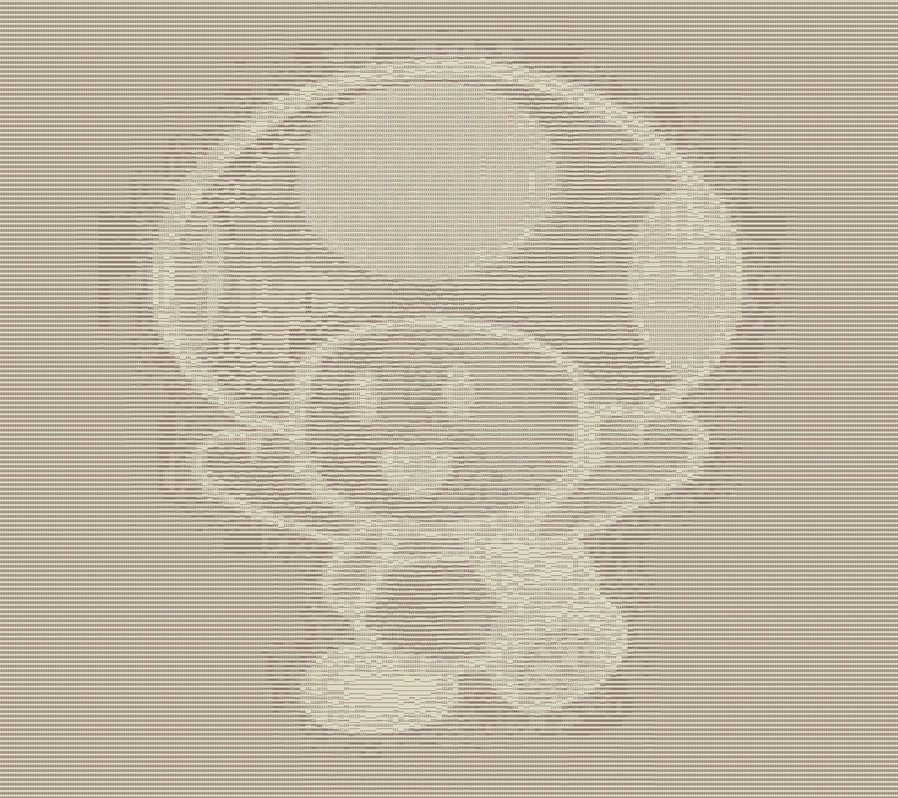

# ASCII Art generator

The idea for this project came from: https://robertheaton.com/2018/06/12/programming-projects-for-advanced-beginners-ascii-art/

## How to use

```
sbt "run /Users/hjlo/Downloads/wink.png"
```

If no image is passed a default image from resources folder is used

Enjoy! :mushroom:

